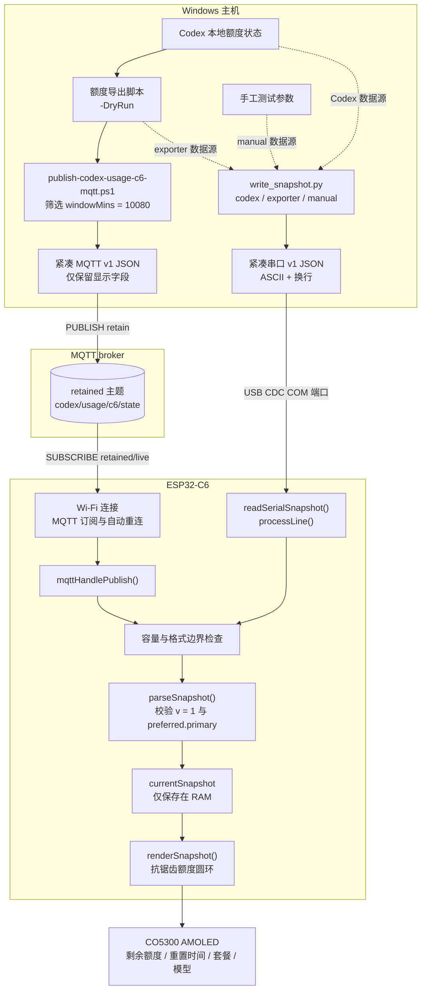

# CodexMeter C6：Codex 周额度 AMOLED 监视器

CodexMeter C6 是为 Waveshare ESP32-C6-Touch-AMOLED-1.43（466×466、CO5300）制作的桌面额度监视器。Windows 主机把 Codex 七天额度压缩为最小化 JSON 快照并发布到 MQTT；设备通过 2.4 GHz Wi-Fi 订阅 retained 消息，在圆形 AMOLED 上显示剩余额度、重置时间、套餐和模型信息。

本仓库不包含 Wi-Fi 密码、MQTT 凭据、OAuth 令牌、Cookie 或用户目录路径。所有本地连接信息都通过未跟踪的配置文件或环境变量提供。

## 功能

- 显示七天额度的剩余百分比、已用比例和重置倒计时。
- 使用 RGB565 覆盖率混色位图绘制抗锯齿圆环，避开 CO5300 上 `fillArc()` 的端点伪影。
- MQTT 断线自动重连，并定期重新订阅 retained 主题。
- 保留 USB CDC 快照入口，便于无 MQTT 环境下诊断显示与解析逻辑。
- 只接收显示所需字段，设备端不保存 Codex 登录态或账号凭据。
- 标题读取 MQTT 快照的 `planLabel`（兼容 `plan`），不再写死 Plus/Pro；等待数据时显示 `PLAN PENDING`，缺失计划时显示 `UNKNOWN`。
- 支持带密码认证的局域网 OTA，保留 USB 烧录与诊断入口。

## 硬件与软件

- Waveshare ESP32-C6-Touch-AMOLED-1.43 Rev1.3
- Arduino CLI
- Arduino-ESP32 3.3.11
- GFX Library for Arduino 1.6.4
- Adafruit XCA9554 1.0.0（依赖 Adafruit BusIO）
- Python 3.10+ 与 pyserial 3.5（仅 USB CDC 工具需要）
- 可访问的 MQTT 3.1.1 broker，以及能够输出 Codex 额度状态的本地主机导出脚本

依赖许可证和上游链接见 [THIRD_PARTY_NOTICES.md](THIRD_PARTY_NOTICES.md)。

## 数据流转过程



- MQTT 是日常主链路：主机端先筛选 `windowMins = 10080` 的七天额度，再发布 retained 快照；设备重启后可从 broker 恢复最近一次数据。
- USB CDC 是诊断旁路：`write_snapshot.py` 可从 Codex app-server、外部导出脚本或手工参数生成相同 v1 结构，并复用设备端解析与渲染流程。
- `parseSnapshot()` 负责校验 `v = 1` 和 `preferred.primary`；有效数据写入 RAM 中的 `currentSnapshot`，不会把 Codex 登录态写入设备。
- 不要把包含历史桶和大量字段的完整主机状态直接发送给设备；压缩、七天窗口选择和隐私裁剪都属于主机端边界。

## 快速开始

### 1. 安装构建依赖

```powershell
arduino-cli core update-index
arduino-cli core install esp32:esp32@3.3.11
arduino-cli lib install "GFX Library for Arduino@1.6.4" "Adafruit XCA9554@1.0.0"
python -m pip install -r requirements.txt
```

### 2. 创建本地凭据文件

```powershell
Copy-Item .\src\secrets.example.h .\src\secrets.h
```

编辑 `src/secrets.h`，填写自己的 2.4 GHz Wi-Fi 和 MQTT 参数。该文件不会被 Git 跟踪。提交前仍应运行 `git status`，不要因为有 `.gitignore` 就跳过检查，老师——凭据预算可没有透支额度。

### 3. 编译与刷写

```powershell
$fqbn = 'esp32:esp32:esp32c6:FlashSize=16M'
arduino-cli compile --fqbn $fqbn --build-path .\.arduino-build .
arduino-cli upload --fqbn $fqbn --port COM3 --input-dir .\.arduino-build
```

`COM3` 只是示例；请以设备管理器或 `arduino-cli board list` 当前识别到的端口为准。

### 4. 启用并使用 OTA（Windows / PowerShell 7）

首次启用需要 USB 烧录一次。使用 Arduino-ESP32 **3.3.11** 自带的 ArduinoOTA 与 `espota.py`；认证协议须使用配套版本。默认分区已有两个 `0x140000` 字节应用槽，不修改分区表。

```powershell
# 生成随机密码，仅以当前 Windows 用户的 DPAPI 加密形式保存；重复运行不会覆盖。
pwsh -NoProfile -File .\tools\ota.ps1 -Action Initialize

# 编译过程中生成临时认证哈希头文件，结束后清理；明文密码不写入源码。
pwsh -NoProfile -File .\tools\ota.ps1 -Action Build
arduino-cli upload --fqbn 'esp32:esp32:esp32c6:FlashSize=16M' --port COM3 --input-dir .\.arduino-build-ota

# 后续更新：重新编译后通过 Wi-Fi 烧录应用镜像。
pwsh -NoProfile -File .\tools\ota.ps1 -Action Build
pwsh -NoProfile -File .\tools\ota.ps1 -Action Upload -Address codexmeter-c6.local
```

工具支持 `-ArduinoCli`、`-Libraries`、`-BuildPath`、`-Python`、`-Espota`、`-Firmware` 指定本机路径。只有应用 `.ino.bin` 可用于 OTA；工具拒绝错误芯片、超出分区容量、merged 和 bootloader 文件。直接运行普通 `arduino-cli compile` 不会带入 OTA 凭据，**会得到禁用 OTA 的固件**；需要 OTA 时始终使用上述 `-Action Build`。

若 mDNS 不可用，向串口发送 `CODEX_DIAG`，用 `CODEX_NETWORK` 的 IP 作为 `-Address`。设备监听 UDP 3232，并回连上传主机 TCP 3233（可用 `-HostPort` 修改）；仅在可信局域网放行相应流量。上传密码不会进入命令行参数。也可在本机通过 `CODEX_C6_OTA_PASSWORD` 提供至少 16 位密码，编译与上传必须使用同一个密码。

`.local/ota-password.dpapi` 只能由对应 Windows 用户解密，不应提交或公开备份。丢失该文件或更换 Windows 用户后，重新初始化凭据并通过 USB 烧录。未完成的传输不会切换启动分区；本配置**没有启用启动健康检查失败自动回滚**，新固件无法启动时用 USB 恢复。

OTA 时串口输出 `CODEX_OTA_START/PROGRESS/COMPLETE`，重启后 `CODEX_DIAG` 可检查构建时间、运行分区和下一升级分区。设备启动输出 `CODEX_OTA_READY ... auth=required` 才表示 OTA 已开启。

## 发布 MQTT retained 快照

`tools/publish-codex-usage-c6-mqtt.ps1` 会调用一个本机额度导出脚本的 `-DryRun` 模式，并把七天额度压缩后发布到设备主题。这个外部导出脚本不属于本仓库，必须通过环境变量或 `-ReferenceScript` 指定。

推荐把连接信息只放在当前 PowerShell 会话的环境变量中：

```powershell
$env:CODEX_USAGE_EXPORTER_SCRIPT = 'C:\path\to\publish-codex-usage-mqtt.ps1'
$env:CODEX_C6_MQTT_HOST = 'mqtt.lan'
$env:CODEX_C6_MQTT_USERNAME = 'device-publisher'
$env:CODEX_C6_MQTT_PASSWORD = 'replace-with-local-secret'
$env:CODEX_C6_MQTT_TOPIC = 'codex/usage/c6/state'

pwsh -NoProfile -File .\tools\publish-codex-usage-c6-mqtt.ps1 -DryRun
pwsh -NoProfile -File .\tools\publish-codex-usage-c6-mqtt.ps1
```

`-DryRun` 只打印紧凑 JSON，不连接 MQTT。真实发布默认使用 retained 消息；可用 `-NoRetain` 临时关闭。

日常链路保持为 **Windows 服务/计划任务 → MQTT → ESP32**：设备只在接收到推送快照后更新计划和额度，不主动读取 Codex，不新增实时轮询，也不改变主机推送频率。计划来自导出脚本实际读取的 `codex_plan_type`；Codex 接口字段见 [官方 app-server 文档](https://learn.chatgpt.com/docs/app-server)。

## USB CDC 诊断入口

`tools/write_snapshot.py` 可以直接从 Codex app-server、外部导出脚本或手工参数生成快照。默认刷新间隔为两小时，持续模式的最小间隔为五分钟。

```powershell
# 只生成快照，不访问串口
python .\tools\write_snapshot.py --source codex --dry-run

# 手工测试设备解析与显示
python .\tools\write_snapshot.py --source manual --remaining 73 --window-mins 10080 --port COM3

# 使用外部导出脚本持续刷新
$env:CODEX_USAGE_EXPORTER_SCRIPT = 'C:\path\to\publish-codex-usage-mqtt.ps1'
python .\tools\write_snapshot.py --source exporter --watch --interval 7200 --port COM3
```

## 本地验证

```powershell
python -m unittest discover -s tools -p 'test_*.py'
arduino-cli compile --fqbn 'esp32:esp32:esp32c6:FlashSize=16M' --build-path .\.arduino-build .
```

构建前必须存在本地 `src/secrets.h`。发行检查还应确认 `git status` 中没有该文件、构建目录、日志或缓存。

## 已知限制

- MQTT 当前使用明文 TCP/1883，不支持 TLS；只适合可信局域网。详见 [SECURITY.md](SECURITY.md)。
- Wi-Fi/MQTT 凭据仍会编译进设备固件，只是不会进入 Git 仓库。后续可增加安全配网与设备端凭据存储。
- 当前未启用触摸功能。
- 快照保存在 RAM 中；设备重启后依赖 MQTT retained 消息恢复。
- MQTT 客户端是面向本项目最小需求的实现，不是通用 MQTT 库。

## 许可证

项目自身源码采用 [MIT License](LICENSE)。第三方依赖保留其各自许可证与版权。
